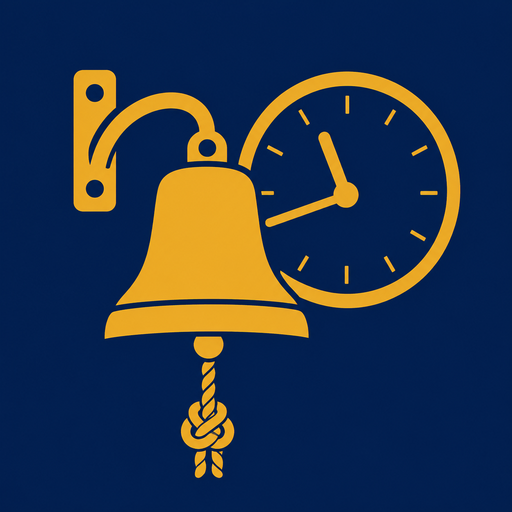

# signalk-ships-bells

[](https://github.com/BoatHacks/signalk-ships-bells/actions/workflows/ci.yml)



A [SignalK Server](https://github.com/SignalK/signalk-server) plugin that plays traditional ship's bell audio on the watch schedule (one strike every half hour, up to eight bells).

## Status

Watch-bell scheduling and playback are both implemented: `index.js` computes
the strike schedule and emits a notification delta; the `public/` webapp
listens for it over the SignalK websocket and plays the matching audio file.

## Features

- Strikes the bell every half hour, 1–8 bells, following the traditional watch
  schedule. Configurable in the SignalK admin UI (Server → Plugin Config →
  Ship's Bell):
  - **Enable bell strikes** — on/off.
  - **Watch bell schedule** — three selectable conventions for the second dog
    watch (18:00–20:00), the one place historical practice diverges:
    - *British Navy* — resets to 1 bell at 18:30 instead of continuing 5-6-7,
      per the post-1797 Royal Navy convention adopted after the Nore mutiny
      (five bells in the second dog watch had been the mutiny's signal).
    - *Standard* — ignores the dog-watch split as a concept and just
      cycles 1–8 every 4 hours all day.
    - *Pre-1797* — the older convention, continuing 5-6-7 bells through the
      second dog watch before the full 8 at the watch change.

      (Standard and pre-1797 produce identical strike patterns — splitting
      a 4-hour watch into two 2-hour ones doesn't change the half-hourly count
      unless something resets it. They're offered as separate, differently
      labeled options rather than because the underlying schedule differs.)
  - **Mute bell when at anchor or moored** — skips playback while
    `navigation.state` is `anchored` or `moored`. Requires that path to be
    populated by something on your system — see below.
  - **Playback method** — `webapp`, `server speaker`, or `both`:
    - *Webapp* — each strike is sent as a `notifications.plugins.signalkShipsBell.strike`
      delta. The bundled webapp (open it from the SignalK admin UI's webapps
      list, or at `/signalk-ships-bells/`) subscribes to that delta over the
      websocket and plays the matching file via `<audio>` — so it sounds
      wherever that page is open (e.g. a browser tab on an MFD or tablet at
      the helm). A "play test bell" button is included for checking that
      audio works without waiting for the next half hour - it plays locally
      in the browser immediately, and also asks the plugin to attempt
      server-speaker playback if that's part of the configured playback
      method, so it exercises whichever output(s) are actually configured.
    - *Server speaker* — plays directly on the machine running Signal K, via a
      speaker wired to it, using [play-sound](https://www.npmjs.com/package/play-sound)
      to shell out to a system audio player. No browser needed. This is the
      same underlying approach as
      [signalk-audio-notifications](https://github.com/meri-imperiumi/signalk-audio-notifications),
      which plays spoken alerts the same way. Requires a system player such as
      `mpg123` or `aplay` to be installed on that machine — `play-sound` picks
      whichever it finds. If none is found, an error is logged and playback is
      silently skipped rather than crashing the plugin.
    - *Both* — does both of the above.
- **Schedule selection from the webapp** — the same watch-bell schedule choice
  is also available directly in `public/`, via a dropdown that reads and
  writes the setting through a small REST API exposed by the plugin
  (`GET`/`PUT /plugins/signalk-ships-bells/schedule`), so it can be changed
  without going into Server → Plugin Config.

## Recommended companion plugins

- [signalk-autostate](https://github.com/meri-imperiumi/signalk-autostate) —
  automatically sets `navigation.state` (e.g. `anchored`, `moored`, `sailing`,
  `motoring`) from GPS and propulsion data. The "mute at anchor or moored"
  option here depends on `navigation.state` being set by something; if you
  don't already have a source for it, this plugin is a good fit.

## Audio assets

`public/bells/` bundles one WAV file per strike count, `bell-strikes-1.wav` through
`bell-strikes-8.wav`, served statically by SignalK server's signalk-webapp hosting
at `/signalk-ships-bells/bells/`. These are sourced from Benboncan's "Bells / Gongs"
pack on Freesound (CC BY 4.0) — see `public/bells/NOTICE.md` for full attribution.

## Install

Available on npm as [`signalk-ships-bells`](https://www.npmjs.com/package/signalk-ships-bells) —
install it from the SignalK Server admin UI's App Store, or via:

```
npm install signalk-ships-bells
```

For local development, clone into your SignalK server's `node_modules`, or use `npm link`.

## Development

Run the test suite with:

```
npm test
```

This runs Node's built-in test runner (`node --test`) over `test/*.test.js`, which
covers the bell-schedule math for all three watch schemes, the plugin's config
schema, its start/stop/restart lifecycle, and the `/schedule` REST endpoint.

CI runs on every push and pull request via the reusable
[SignalK plugin-ci workflow](https://github.com/SignalK/signalk-server/blob/master/.github/workflows/plugin-ci.yml)
(`.github/workflows/ci.yml`), which additionally validates the plugin's
`package.json`, entry point, schema, and lifecycle across Linux, macOS,
Windows, and Raspberry Pi-class Node versions.

## License

Source code: MIT. Bundled bell audio (`public/bells/`): CC BY 4.0, attributed to
Benboncan on Freesound. See `LICENSE` for the full text of both.
